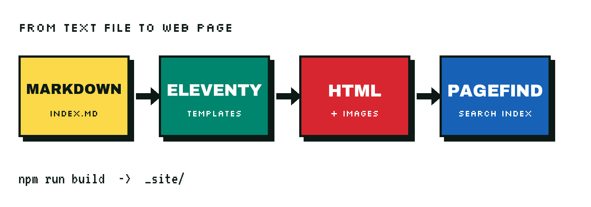

This site is a folder of text files. There is no database, no admin panel and no server-side code. Here is how a Markdown file becomes the page you're reading.



## What is a static site generator?

A static site generator takes content files and templates and produces finished HTML ahead of time. Visitors download ready-made pages, which makes them fast, cheap to host and hard to break. This site uses [Eleventy](https://www.11ty.dev/).

## How does a new article get published?

Each article lives in its own folder, named with the date and a short slug:

```text
src/posts/2026-09-28-how-this-blog-is-built/
├── index.md       ← the article
├── cover.png      ← cover image
└── pipeline.png   ← an image used in the text
```

The top of `index.md` holds the details the site needs: title, description, date, tags and a short list of key points.

```yaml
---
title: "How this blog is built"
description: "A tour of the publishing setup behind this site."
date: 2026-09-28
tags: [software, web, seo]
image: ./cover.png
imageAlt: "A floppy disk labelled BLOG.SYS"
---
```

When I push the change, the host runs `npm run build` and the new article goes live, along with updated tag pages, the archive, the RSS feed and the sitemap.

## How do images stay fast?

Images are processed at build time. Each one is resized to several widths and converted to modern formats (AVIF and WebP), with the original format kept as a fallback. The browser picks the smallest file that fits, and every image has its dimensions set so the page doesn't jump while loading.

## How does search work without a server?

After the HTML is built, [Pagefind](https://pagefind.app/) reads every article and writes a compact search index into the site. When you search, your browser downloads only the small slices of the index it needs. It works on any static host.
