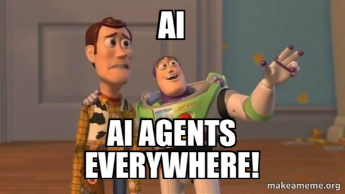

With AI impacting the workplace at such a rapid rate, it’s only natural to feel unsettled by it.

If you feel a flicker of unease watching AI do things you spent years learning to do well, you are not being irrational or precious, you are having a completely reasonable response to a genuinely unusual situation. Even professionals who are comfortable with AI, and using it extensively, still get the occasional moment of "wait, what does this mean for me?"

That feeling is just your instincts kicking into gear; providing you with information that will help you ask the right questions and make the right decision.

## Am I being replaced?

The AI shift isn't only a technology story. For a lot of us, it's an identity one. We're used to drawing meaning, status and a sense of self-worth from being good at our work. So when the thing we're good at suddenly looks less rare, the discomfort goes deeper than career logistics. It touches how we see ourselves.

Recognising that is not a step backwards. It actually helps you identify the core issues rather than being overwhelmed with a vague cloud of dread. The path forward from here is to use the anxiety as a signal, understand what it means and identify the best response.

## Treat the feeling as a signal, not a verdict

The anxiety you feel is telling you something genuinely healthy; that you care about your work and your future, and that you're paying enough attention to notice the ground shifting. Both of those are strengths.

The feeling only becomes a problem if you let it freeze you, but we can learn from similar episodes in the past. The skilled typist felt this when word processors arrived. The expert draughtsperson felt it when design software emerged. In each case the specific skill became less scarce, and in each case the people who thrived were the ones who moved up the value chain rather than gripping tightly to the thing being automated. The anxiety was informative but the response decided the outcome.

We are in that same moment, right now. The feeling is doing its job. What happens next is up to you.

## Build confidence the only way it's ever built

Stepping into new technology, or possibly even into a new career path, is daunting. Waiting until you feel ready is not going to work. Confidence is what you get after you act, not before.

The most reliable antidote to AI anxiety is a small, concrete win. The first time you use AI to produce something genuinely good in half the usual time, something shifts, not just in your output, but in your perspective on the situation. You stop seeing a threat and start seeing leverage. Fears get replaced by opportunities, leading to new ideas and increased motivation.

So set yourself one small challenge this week. Use AI on a real task, and notice the result. Then do it again. Confidence in the AI era isn't a feeling you wait to be granted. It's a habit you build, one small success at a time.

## Separate who you are from what you do

This is easier said than done. You are not "a person who writes reports" or "a person who builds models." You are a professional with judgment, relationships, hard-won expertise and values, all of which happen to express themselves through those tasks right now.

While the tasks change, the underlying capabilities are yours, and they can’t be automated.

Try noting down the three or four things you genuinely contribute at your best, not the tasks, but the deeper capabilities underneath them; the knack for finding the insight buried in messy information, the ability to bring people to agreement, the instinct for spotting a problem before it becomes a crisis. Those are the foundations of your professional identity and remain valuable regardless of technological advancement.

## Ignore the AI hype train

One more thing that’s critical for your mental health. AI plus social media has produced a particularly brutal version of the comparison trap. Everywhere you look, someone is sharing their dazzling AI-powered output, their productivity breakthroughs, their apparent total mastery. Against your own messier, more uncertain experiments, it can feel deflating.

Remember what you're looking at. Social media shows peaks, not averages, and the loudest sharers of AI success are rarely the most capable users of it in practice. Your competition was never their highlight reel, it's your own performance last month. If you're more capable this month than last, you're doing exactly what the moment asks. Everything else is noise, and psychologically damaging noise, at that.

## The point of all this

The goal was never to feel untroubled by change. That's neither realistic nor even useful. The goal is to be troubled by it in the way that moves you forward rather than the way that freezes you in place.

You've already done the hard part, which is caring and paying attention; proved by anxiety. Now channel that into one small win this week. One capability you can add to your toolbox. One reminder that you've adapted to rapid change before and come out more capable on the other side.

Feeling like you’re behind is just a perspective that can change in a day. You're aware of the moment, and awareness is where every good adaptation begins. Use it.

